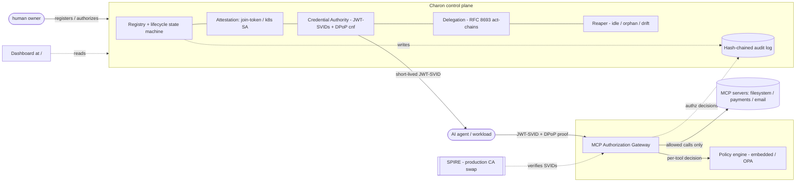

# Charon — NHI Lifecycle Engine for AI Agents

A self-hostable control plane that manages the full lifecycle of **non-human
identities** (AI agents, workloads, automated processes): attestation,
short-lived credential issuance, gated lifecycle transitions, rotation,
revocation, and a tamper-evident audit trail — built on SPIFFE naming and JWT
SVIDs.

> Most enterprise tooling for this (Astrix, Oasis, Token Security, Akeyless) is
> closed and priced for enterprises; the open-source layer (SPIFFE/SPIRE, Vault,
> Teleport) gives you identity *plumbing* but leaves the lifecycle/governance
> layer to you. Charon is that layer, focused on the still-unsolved AI-agent
> frontier. See `docs/DESIGN.md` for the full landscape analysis and roadmap,
> and `docs/THREAT_MODEL.md` for the security framing.

## Status

| Phase | Scope | State |
|---|---|---|
| **0 — Foundations** | Repo, design doc, threat model mapped to OWASP MCP Top 10 + NIST questions | ✅ done |
| **1 — Identity Registry + Lifecycle** | Agent objects, persistence, CRUD, gated state machine, hash-chained audit | ✅ done |
| **2 — Credential Authority** | Short-lived JWT-SVIDs, SPIFFE naming, scope claims, rotation, revocation, key rotation | ✅ done |
| **3 — Attestation** | Pluggable attestors (join-token, k8s SA JWT, dev); issuance gated on fresh attestation; selector binding | ✅ done |
| **4 — MCP Gateway + Policy** | Toy MCP servers; per-tool authorization via embedded engine or OPA; scope + argument constraints | ✅ done |
| **5 — Delegation + Provenance** | RFC 8693 token exchange, `act`-claim chains, downscoping, provenance trace, delegation graph | ✅ done |
| **6 — Reaper + Dashboard** | idle/orphan/drift detection + auto-decommission; inventory/lifecycle/delegation dashboard | ✅ done |
| **7 — Hardening** | DPoP proof-of-possession; SPIRE integration adapter; hash-chained audit; adversarial test suite | ✅ done |
| **8 — Polish & writeup** | architecture diagram, demo script, positioning post, LICENSE | ✅ done |

**84 tests passing** across unit and adversarial suites; four runnable demos.

## Architecture (layered for testability)



```
charon/
  spiffe.py        SPIFFE ID construction / parsing
  lifecycle.py     state machine + gated transitions (pure, no I/O)
  models.py        domain dataclasses (persistence-independent)
  audit.py         hash-chained, tamper-evident audit log
  ca.py            Ed25519 signing authority + trust bundle (key rotation)
  credentials.py   Credential Authority: issue / verify / rotate / revoke JWT-SVIDs
  attestation.py   pluggable attestors: join-token, k8s SA JWT, dev (Phase 3)
  delegation.py    RFC 8693 token exchange + act-claim chains + provenance (Phase 5)
  dpop.py          DPoP proof-of-possession: RFC 9449 + RFC 7638 thumbprints (Phase 7)
  spire.py         SPIRE integration adapter (py-spiffe) — production CA swap (Phase 7)
  reaper.py        idle/orphan/drift detection + auto-decommission (Phase 6)
  policy.py        authorization engines: embedded (default) + OPA-backed (Phase 4)
  repository.py    Repository interface + stdlib-sqlite3 implementation (Postgres-ready)
  service.py       Registry: orchestrates lifecycle + attestation + delegation + audit
  mcp/servers.py   toy MCP servers: filesystem, payments, email (Phase 4)
  mcp/gateway.py   MCP authorization gateway: per-tool authz enforcement point (Phase 4)
  mcp/stdio_server.py  real MCP-SDK entrypoint wrapping the gateway
  api/main.py      FastAPI HTTP layer (thin adapter over service.py)
  api/dashboard.py single-page dashboard: inventory + lifecycle + delegation graph (Phase 6)
  policies/authz.rego  Rego policy mirroring the embedded engine (for OPA)
```

The security-critical logic (lifecycle, credentials, audit) depends only on
`PyJWT` + `cryptography` and is fully unit-tested. The web framework and database
are adapters at the edges, so they can be swapped (e.g. SQLite → Postgres, or the
self-signed CA → SPIRE in Phase 7) without touching the security core.

## Quick start

```bash
python -m venv .venv && source .venv/bin/activate
pip install -r requirements.txt

# Run the end-to-end walkthrough (no DB or network needed):
python demo.py            # Phases 1-2: lifecycle + credentials
python demo_gateway.py    # Phases 3-4: attestation + per-tool authorization
python demo_delegation.py # Phases 5-6: delegation provenance + reaper sweep
python demo_hardening.py  # Phase 7: DPoP defeats token theft + replay

# Run the tests:
python -m unittest discover -s tests        # or: pytest

# Run the HTTP control-plane API:
uvicorn charon.api.main:app --reload
# then open http://127.0.0.1:8000/        (dashboard)
#       and http://127.0.0.1:8000/docs    (API)
# State persists in charon.db; the signing key persists in charon_signing_key.pem
# (override paths with CHARON_DB / CHARON_SIGNING_KEY), so tokens survive restarts.

# (Optional) run the gateway as a real MCP server:
pip install mcp
python -m charon.mcp.stdio_server

# (Optional) use OPA instead of the embedded policy engine:
opa run --server policies/        # then construct MCPGateway(..., policy=OpaPolicyEngine())
```

> The core (`demo.py`, all tests) runs with just `PyJWT` and `cryptography`.
> `fastapi`/`uvicorn` are only needed for the HTTP layer.

## What it does today (Phases 1–2)

1. **Register** a non-human identity with an owner, purpose, and scopes; it is
   assigned a SPIFFE ID (`spiffe://<trust-domain>/agent/<id>`) and starts
   `PROVISIONED`.
2. **Attest** the workload. Credentials and activation are *gated* on this — an
   un-attested identity gets nothing.
3. **Issue** a short-lived JWT-SVID carrying the agent's scopes; the first
   issuance activates the agent.
4. **Verify** credentials against the trust bundle, with audience, expiry, and
   revocation checks.
5. **Rotate** (issues fresh, revokes prior) and **revoke** credentials; **rotate
   the signing key** while keeping older tokens verifiable until they expire.
6. **Transition** through `PROVISIONED → ACTIVE → IDLE → REVOKED →
   DECOMMISSIONED`, with illegal transitions rejected.
7. Every operation is recorded in a **hash-chained audit log** whose integrity
   can be verified (`GET /audit` returns `intact: true/false`).

## What it does today (Phases 3–4)

8. **Attestation before issuance.** A workload must prove itself before getting a
   credential. `JoinTokenAttestor` issues single-use, expiring tokens;
   `K8sServiceAccountAttestor` verifies a projected Kubernetes SA JWT against the
   cluster's keys and extracts namespace/service-account selectors. Attestation
   carries a TTL, so identities must periodically re-prove themselves, and
   issuance is refused if no fresh attestation is on record. The insecure local
   path uses `DevAttestor`, which records `method="dev-insecure"` so the gap is
   never silent. Selectors can be *bound* so a credential for one workload
   identity can't be obtained by another.
9. **Per-tool authorization.** The `MCPGateway` fronts the toy MCP servers
   (filesystem, payments, email) and authorizes every `tools/call` against the
   credential's scopes and argument-level constraints (path confinement, amount
   caps) — closing MCP's all-or-nothing access gap. `tools/list` only advertises
   tools the credential can actually invoke. Policy runs in a dependency-free
   embedded engine by default, or in OPA via `policies/authz.rego`. Every
   allow/deny decision lands in the same audit chain.

**Phase 4 milestone (see `demo_gateway.py`):** an agent scoped to `fs:read` reads
files under `/data` but is denied `payments.charge` (missing scope), denied
`/etc/shadow` (path escape), and the gateway hides tools it can't use.

## What it does today (Phases 5–6)

10. **Delegation with provenance.** RFC 8693 token exchange lets one agent act on
    behalf of another while preserving the originating human as `sub` and nesting
    each actor in the `act` claim. Authority only ever **narrows** down a chain
    (requested scope must be a subset of the delegating token's scope). `trace()`
    reconstructs the full path back to the human, and the gateway records that
    provenance on every delegated call.
11. **The Reaper.** A sweep that moves inactive `ACTIVE` agents to `IDLE`,
    decommissions long-idle ones, revokes-and-decommissions **orphaned** agents
    whose owner has departed, and **flags privilege drift** (granted scopes never
    exercised, derived from the audit log). It runs in apply or dry-run mode, and
    every action flows through the audited lifecycle transitions.
12. **Dashboard** at `GET /` — lifecycle state counts, the identity inventory,
    a delegation graph (principal → agents), a reaper dry-run preview, and the
    live audit feed with chain-integrity status.

**Phase 5 milestone (see `demo_delegation.py`):** a `human -> A -> B -> C` chain,
traced from C's credential all the way back to the human.

## What it does today (Phase 7 — hardening)

13. **Proof-of-possession (DPoP, RFC 9449).** Credentials can be bound to a
    client key via a `cnf.jkt` claim. The gateway then requires a fresh DPoP
    proof on every call, signed by the matching private key and bound to the
    method + URL with a single-use `jti`. A stolen token is useless without the
    key, and a captured proof cannot be replayed.
14. **SPIRE integration.** `charon/spire.py` provides workload-side and
    gateway-side adapters (`py-spiffe`) so SPIRE can replace the self-signed CA
    in production; the gateway's verifier seam takes a `SpireJwtVerifier` with no
    other changes.
15. **Adversarial test suite.** `tests/test_adversarial.py` proves the controls
    resist token theft, proof replay, scope escalation, confused-deputy forgery,
    and audit tampering — not just that the happy path works.

**Phase 7 milestone (see `demo_hardening.py`):** the same stolen token is allowed
for the key-holder and denied (no proof / wrong key / replayed proof) for everyone
else.

## Documentation

- `docs/DESIGN.md` — landscape analysis and full roadmap
- `docs/THREAT_MODEL.md` — assets, adversaries, OWASP MCP Top 10 + NIST mapping
- `docs/BLOG.md` — positioning post: where Charon fits against the standards gaps
- `docs/DEMO_SCRIPT.md` — 3-minute demo recording script

## HTTP endpoints

| Method | Path | Purpose |
|---|---|---|
| POST | `/agents` | register an identity |
| GET | `/agents` / `/agents/{id}` | inventory |
| POST | `/agents/{id}/attest` | attest a workload |
| POST | `/agents/{id}/transition` | gated lifecycle transition |
| POST | `/agents/{id}/credentials` | issue a JWT-SVID |
| POST | `/agents/{id}/credentials/rotate` | rotate |
| POST | `/agents/{id}/credentials/revoke` | revoke |
| POST | `/credentials/verify` | verify a token |
| POST | `/delegation/begin` | start a chain (agent on behalf of a human) |
| POST | `/delegation/exchange` | RFC 8693 token exchange (hop N>1) |
| POST | `/delegation/trace` | reconstruct a credential's provenance path |
| GET | `/delegations` | delegation edges (for the graph) |
| POST | `/reaper/run` | run the reaper (apply or dry-run; optional `now` override) |
| POST | `/mcp/tools` | list tools the credential may call (via the gateway) |
| POST | `/mcp/call` | authorize + forward a single tool call (per-tool authz over HTTP) |
| GET | `/` | dashboard |
| GET | `/.well-known/charon/trust-bundle` | public keys for verifiers |
| GET | `/audit` | audit trail + integrity status |

## License

See the `LICENSE` file (MIT). The OWASP MCP Top 10 material referenced in
`docs/THREAT_MODEL.md` is CC BY-NC-SA 4.0 and is only cited, not reproduced.
